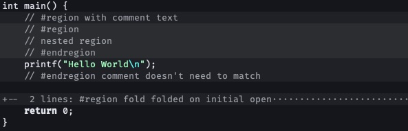

# region-highlight.nvim



Code region declarations for Neovim, inspired by other Editors `#region` / `#endregion` markers.

⚠️ Disclaimer: This is a **100% Vibe-coded Plugin.**

## Features

- **Visual highlighting**: Regions are visually tinted
  - nested regions are respected
  - `colorcolumn` remains visible (in this case is manually redrawn)
  - Bring your own color palette, or disable coloring entirely
- **Region folding**: Use `za` on a `#region` line to fold/unfold
  - `#region fold` auto-closes on initial file load only
- **% jumping**: Press `%` on a `#region` or `#endregion` to jump to its pair
- **Region picker**: jump to any region via snacks.nvim fuzzy picker — current buffer (`:RegionPickerBuf`) or whole project (`:RegionPickerGlobal`, requires `rg`); requires [snacks.nvim](https://github.com/folke/snacks.nvim)
- **Language-aware**: Uses treesitter to detect comment lines; falls back gracefully
- **Live refresh**: Highlights update automatically as you edit (debounce configurable)

## Installation

### lazy.nvim
```lua
{
  "Felix-Kettnaker/region-highlight.nvim",
  event = "BufReadPost", -- load on file open so highlights appear immediately
  opts = {},             -- or pass your config options here
  -- optional key bindings for the snacks.nvim pickers:
  keys = {
    { "<Leader>fR", function() require("region-highlight").pick_global() end, desc = "Pick Region (Global)" },
    { "<Leader>fr", function() require("region-highlight").pick() end,        desc = "Pick Region (Buffer)" },
  },
}
```

> ⚠️ **Do not use `keys` as the only lazy trigger.** If `keys` is specified without an `event`, the plugin only loads when you press those keys — highlights and folding won't appear until then. Always include `event = "BufReadPost"` so the plugin loads when a file is opened.

```

## Usage

Add region markers inside comments. The marker must appear within a comment line — bare code lines are ignored.

### Default case
`#region` inside a normal comment:

```lua
-- #region
localmy_table = {}
-- #endregion
```

- `// #region My Section` for example in JS
- `-- #region My Section` for example in Lua

### Languages with #-Comments
Since the comment already starts with # you can omit the extra ` #`.
- `#region My Section` for python or GDScript
- `# #region` works nonetheless
- for GDScript, `#region` is recommended since that's the only way it's recognized as a region by the Godot Editor


Regions can be nested. Each level adds another tint step, so nesting stays visually distinguishable.

```lua
-- #region Outer
local a = 1
-- #region Inner
local b = 2
-- #endregion
-- #endregion
```

### Auto-fold on load

With `#region fold` the region auto-closes when the file is first opened

## Configuration
defaults:
```lua
require("region-highlight").setup({
  -- auto-close everything on load, regardless of `fold`-keyword
  fold_all = false,

  -- Debounce delay (ms) for re-processing after text changes
  -- lower values feel snappier, higher values are better for performance
  refresh_debounce = 300,

  -- Custom background colors, cycled by encounter order across the file.
  colors = nil,
  -- custom colors are cycled per buffer in region encounter order
  -- colors = { "#1e1e2e", "#1e2e1e", "#2e1e1e" }
  -- Set to false to disable background highlighting entirely.
  -- colors = false
})
```

### Default tinting

Without `colors`, the plugin automatically derives tint colors from your theme's `Normal` background:

- **Dark themes**: each region level blends 5% towards white
- **Light themes**: each region level blends 5% towards black

Tints stack: a region at depth 2 is twice as tinted as depth 1.

## Folding and navigation

Regions are registered with `foldmethod=expr`. This means:

- `za` on a `#region` line folds or unfolds the region
- `zR` / `zM` open / close all folds as usual
- `%` on a `#region` or `#endregion` line jumps to the matching pair (nesting-aware; falls through to matchit / built-in % on other lines)
- ⚠️ This overrides any other `foldmethod` set for that buffer

## Region picker

If [snacks.nvim](https://github.com/folke/snacks.nvim) is installed, two picker commands are available:

| Command | Description |
|---|---|
| `:RegionPickerBuf` | Lists all regions in the current buffer (treesitter-accurate) |
| `:RegionPickerGlobal` | Scans the entire project via `rg` and lists every `#region` (requires [ripgrep](https://github.com/BurntSushi/ripgrep)) |

The preview shows the file at the region's start line. Confirming jumps there and opens any enclosing folds.

You can also bind them to keys:

```lua
vim.keymap.set("n", "<leader>fR", require("region-highlight").pick, { desc = "Region picker (buffer)" })
vim.keymap.set("n", "<leader>fG", require("region-highlight").pick_global, { desc = "Region picker (project)" })
```

## Troubleshooting

### LSP highlights appear over region markers

Some language servers (e.g. `lua-language-server`) return a document-highlight response that spans the entire region when the cursor is on a `#region`/`#endregion` marker. This is intentional server behavior and unrelated to region-highlight.nvim. Disabling the document-highlight feature (e.g. `snacks.nvim` `words`) in your LSP config resolves it.

## Testing

```bash
make test
```

